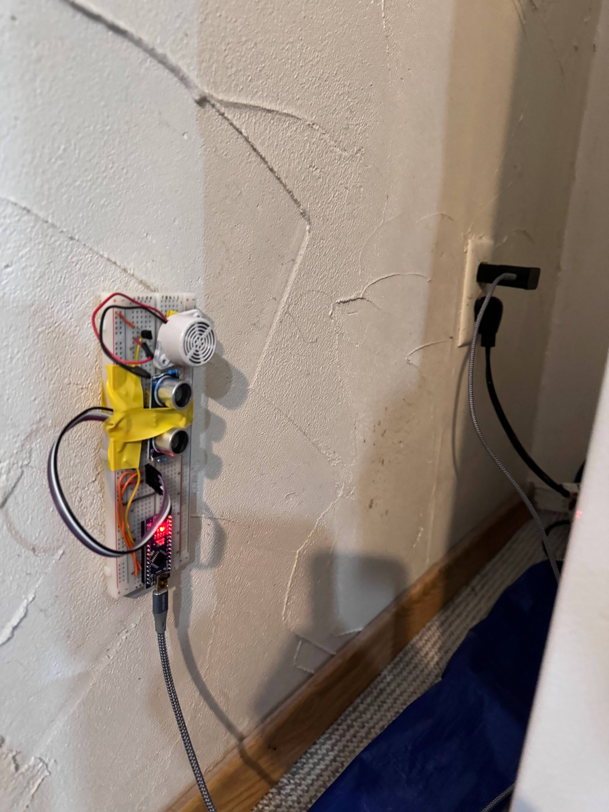

# fridgeSensor
 

My fridge opens randomly, and if no one is in the kitchen, it stays open for a long time. I really don't want the food to go bad, so I made a sensor that beeps very loud until someone closes the fridge door. 

Video Demonstration: 
https://photos.app.goo.gl/chd5CcAcaTNBbfrV7

Rough Order of Events/Timeline: 
- test ultrasonic sensor with Arduino Nano
- write the code so an LED blinks when the fridge door has been open for a certain time, then the LED turns off when the fridge door is closed
- make it so the LED only goes off when the fridge door is closed for 3 seconds, so that the sensor isn't too sensitive and isn't fooled easily
- make it so that the LED blinks instead of just going on and off, and do this without delays (use a boolean and millis) to increase responsiveness
- add a buzzer, and since the Arduino Nano pins cannot supply enough current to make the buzzer very loud, use a transistor
- modify the constants for the time the door must be open for the buzzer to start beeping, and the time the door must be closed for the buzzer to stop beeping, then put everything on the breadboard and attach it to the wall

Last updated: 
April 17th 2024 

Possible Improvements: 
- use the ATtiny85 instead of the Arduino nano as it is smaller, cheaper, and more energy efficient
- try using a battery, and to make this last long, try using a low-power or sleep mode on the ATtiny85**
- 3D print a case so this is much prettier and more durable 

**Note: 
the current consumption of the ATtiny85 is 2mA, the buzzer is 50mA, and the ultrasonic sensor is 15mA max, so totals to about 67mA max with the buzzer on, and 17 mA max with the buzzer off, and for the Duracell 9V alkaline battery I plan to use, the rating is about 550 mAh, so I would get about 8.5 hours of buzzer on and 32 hours without the buzzer, which isn’t even a day. I will try and use a low power mode or something. 
